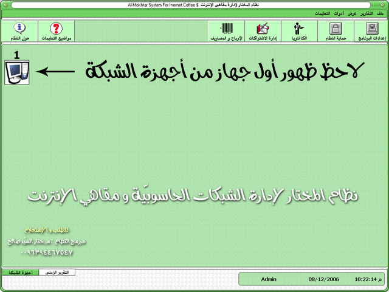



## Al\-Mokhtar Networks Managment System

### Description

Hi every body

this project is a great networks managment system

which depends on VB6 &amp; Winsock &amp; Access database .

Note : this system can manage 40 terminal .

Yes , Download it.

The programmer :

Mokhtar Saied Saleh

Syria - Albokamal

www.abokamal.com

mokhtar_ss@hotmail.com

00963944467547
 
### More Info
 

             |
---                |---
**Submitted On**   |2008-02-23 21:09:04
**By**             |[Mukhtar Sayed Saleh](https://github.com/Planet-Source-Code/PSCIndex/blob/master/ByAuthor/mukhtar-sayed-saleh.md)
**Level**          |Advanced
**User Rating**    |4.0 (12 globes from 3 users)
**Compatibility**  |VB 6\.0
**Category**       |[Complete Applications](https://github.com/Planet-Source-Code/PSCIndex/blob/master/ByCategory/complete-applications__1-27.md)
**World**          |[Visual Basic](https://github.com/Planet-Source-Code/PSCIndex/blob/master/ByWorld/visual-basic.md)
**Archive File**   |[Al\-Mokhtar2103432252008\.zip](https://github.com/Planet-Source-Code/mukhtar-sayed-saleh-al-mokhtar-networks-managment-system__1-70153/archive/master.zip)

